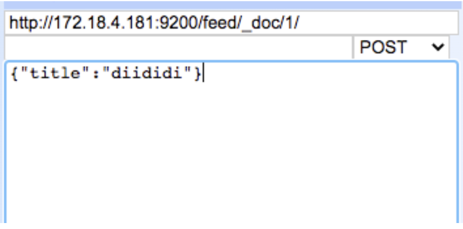

**term用法**

先看看term的定义，term是代表完全匹配，也就是精确查询，搜索前不会再对搜索词进行分词拆解。

比如es中有 love China， love Hubei这两条数据

输入love使用term搜索时，这两条数据都会搜索出来。但是输入 love China就搜索不到结果，这是因为搜索时没有对 love China 进行分词，并且搜索的是es中分词后的数据。

love China 在es中被分为 love和china，因此会查询不到。


如果想用term匹配多个词怎么做？可以使用 terms 来实现 [] 里面或的关系

```java
{
  "query": {
    "terms": {
      "title": ["love", "China"]
    }
  }
}
```


**match用法：**

输入 love China 使用 match搜索时，会将love China， love Hubei这两条数据都搜索出来。 

这是因为match进行搜索的时候，会先进行分词拆分，拆完后，再来匹配，上面两个内容，他们title的词条为： `love china hubei` ，我们搜索的为`love China` 我们进行分词处理得到为`love china` ，并且属于或的关系，只要任何一个词条在里面就能匹配到。


**wildcard用法**

ES中如果我们想要实现MySQL中的like查询的时候可以使用wildcard 通配符来进行操作。其中？代表任意一个字符*代表任意的一个或多个字符。

在Java代码中可以这样使用 

```java
boolQueryBuilder.must(QueryBuilders.wildcardQuery("word", "*" + obj + "*"));
```


但是会遇到这样的问题，在使用模糊查询的时候比如查“马克思”这个名字的时候，我输入 “马\*” 或者 “\*思” 的时候都能查出来但是输入 “马克*” 或者直接 “马克思” 的时候却查不出来，后面经过查询官方文档的时候才发现，在使用 wildcard 进行模糊查询的时候，默认是会对你要查询的字段进行分词查询的 所以 “马克思” 这三个字很可能就被分词成了三个字 这就导致你查询不出来的原因。

解决办法：

我们在使用wildcard模糊查询的时候如果不想对字段内容进行分词查询的话可以将内容变成keyword模式去查询，这样我们进行查询的时候就不会进行分词查询

```java
boolQueryBuilder.must(QueryBuilders.wildcardQuery("word", "*" + obj + "*"));
```


**分词器：**

ES 中处理分词的部分被称作分词器，英文是Analyzer，它决定了分词的规则。ES 自带了很多默认的分词器，比如Standard、 Keyword、Whitespace等等，默认是 Standard。当我们在读时或者写时分词时可以指定要使用的分词器。

写入的文档最终分词结果是什么。通过如下 api 可以查看

```java
POST feed/_analyze
{
  "field": "descraption",
  "text": "呵呵呵测试"
}
```

其中 feed 为索引名，_analyze 表示查看分词结果，请求体中 field 为要查看的字段名，text为具体值。该 api 的作用就是请告诉我在 feed 索引使用 descraption 字段存储一段文本时，es 会如何分词。


**查看es集群的状态**

```json
curl -XGET 'http://localhost:8200/_cluster/health?pretty'
  
{
  "cluster_name" : "if2c",
  "status" : "yellow",   //集群的状态红绿灯，绿：健康，黄：亚健康，红：病态
  "timed_out" : false,
  "number_of_nodes" : 1, //节点数
  "number_of_data_nodes" : 1, //数据节点数
  "active_primary_shards" : 3, //分片数，3个Index库
  "active_shards" : 3,
  "relocating_shards" : 0,
  "initializing_shards" : 0,
  "unassigned_shards" : 3  //未指定节点，配置了复本，仅使用一台机器部署会出现这种情况
}
```


**查看某个分词器的分词情况**

```java
POST _analyze
  {
    "text":"eating",
    "analyzer":"english"
  }
```


**为某个字段设置分词器：**

作用是在feed下新建一个字段：test_field，并且设置分词器为english。

```java
PUT feed/_mapping/
{
  "properties": {
    "test_field":{
      "type":"text",
      "analyzer": "english"
    }
  }
}
```


**搜索时设置分词器：**

```java
POST feed/_search
  {
    "query":{
      "match":{
        "description":{
          "query": "呵呵呵",
          "analyzer": "english"
        }
      }
    }
  }
```


**查看mapping**

```java
curl -XGET "http://127.0.0.1:9200/index/_mapping?pretty"
```


**创建索引**

**创建test索引，指定主分片和副本分片的数量和分词器**

```java
PUT http://loca1host:9200/test
{"settings" : {
        "analysis" : {
            "analyzer" : {
                "ik" : {
                    "tokenizer" : "ik_max_word"
                }
            }
        },
      "index" : {
            "number_of_shards" : 3,
            "number_of_replicas" : 2
        }
    }
}
```


**feed索引下创建 id为1的一条文档**

<div align=middle> </div>