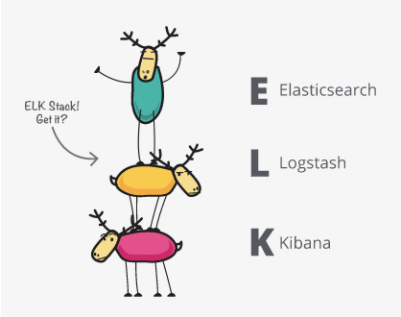
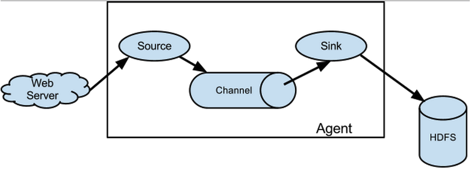

## 一、ELK 简介

“ELK”是三个开源项目的首字母缩写，这三个项目分别是：Elasticsearch、Logstash 和 Kibana。

Elasticsearch 是一个搜索和分析引擎。

Logstash 是服务器端数据处理管道，能够同时从多个来源采集数据，转换数据，然后将数据发送到诸如 Elasticsearch 等“存储库”中。

Kibana 则可以让用户在 Elasticsearch 中使用图形和图表对数据进行可视化。

## 二、基础日志收集

### 2.1、如何把日志数据交给 elk 分析？

收集日志：使用 Flume NG (下文简称 flume) 监控各个服务的日志文件，将日志数据传输到 kafka，再通过 elk 组件里的 logstash 解析从 kafka 得到的日志数据，最后将规范化的日志数据写入 elasticsearch。

Flume ： 是一个分布式、可靠、高可用的海量日志聚合系统，支持在系统中定制各类数据发送方，用于收集数据；同时，Flume NG 提供对数据进行简单处理，并写到各种数据接收方。

Kafka： 是由 `Linkedin` 公司开发的，它是一个分布式的，支持多分区、多副本，基于 Zookeeper 的分布式消息流平台，它同时也是一款开源的基于发布订阅模式的消息引擎系统，由 Scala 和 Java 编写。

使用 kafa 的好处是：

1. 方便统一管理。作为消息中间件，生产者可以发送大量的消息到 kafka 中，这里的生产者就是 flume 。kafka 再将数据分发到不同的主题中，每个不同的消费者组来消费不同的主题的消息，这个消费者在这里面就是 logstash。
   因此，就能够通过一个 kafka 的控制台，就能够知道现在系统全部的一个日志收集情况。有多少的生产者，多少的消费者，消息的生产，消费失败与否，速度多少都能够统一监控。

   

2. 缓冲。当生产者或是消费者的任何一方出现了问题时，都不会对现有的系统产生影响。如果是生产者挂了，那么对应的消费者还是继续订阅 kafka，来消费没有来得及消费的数据。消费者挂了，那么生产者也可以继续向 kafka 生产消息。两者的工作都没有受到影响。

   

3. 系统健壮性。天然的分布式架构使得无论哪一台或是几台机器挂了，都不会影响 kafka 的正常运行。