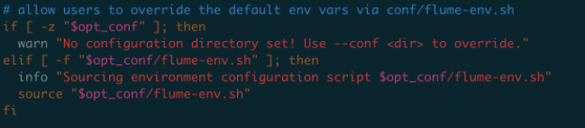

### 1、在需要采集日志的机器上部署 flume

首先 如果机器没有 flume 用户组，先创建 flume 用户和组

```
groupadd flume  
useradd -g flume flume
```


在 flume 用户下安装

安装的 flume 版本：apache-flume-1.9.0-bin（已经在 flumeng.tar.gz 封装好了）

```
cd /home/flume

-- 百度网盘链接
链接: https://pan.baidu.com/s/1IlKgvHp90bq680r6a_m98w  密码: t4iv

tar zxf flumeng.tar.gz 
cd apps 
bash install.sh 
source ~/.bash_profile  

## 测试是否安装成功   
flume-ng  
java -verison
```


这里对 flume 的部署进行了一个封装，更加的自动化。将 flume 运行所需的 apache-flume 和 jdk 提前压缩好，再写好 bash_profile， key 等配置文件，然后写一个 install.sh 控制脚本去执行，最后将这些文件都压缩到 flumeng.tar.gz 中。安装的时候，只需要执行以上几行命令就可以完成自动化安装。


### 2、编写 flume 配置文件 

现在所有的 flume 配置文件都统一放在 git 上进行管理。

git : [flume](https://github.com/2575688848/flume.git)

配置文件解释：flume-back-dev.conf

```
##############################################################################################
##
##   File Name  : flume-back-dev.conf
##   Flume Agent: back_dev，相当于每个 flume 实例的标识，可以自定义
##
##############################################################################################


# back_dev.sources 数据采集源
back_dev.sources = back_java_source back_java_test_source java_error_source java_slow_source

# back_dev.sinks 数据接收方，值是 kafka_sink 可自定义
back_dev.sinks = kafka_sink

# back_dev.channels 采集源到接收方的中间传输管道，值是 kafka_channel 可自定义
back_dev.channels = kafka_channel


####  采集 /home/work/logs/java/local-\.* 路径的日志到 kafka 的 back_java topic 中
########################################################################################################################################
# TAILDIR 方式，监控某个目录的所有文件，或是匹配的特定文件。将监控的记录存储在 back_java_position.json 中，可以实现断点续传。
back_dev.sources.back_java_source.type = TAILDIR

# 监控记录的文件路径
back_dev.sources.back_java_source.positionFile = /home/flume/flume/position/back_java_position.json

# 设置需要监控的文件
back_dev.sources.back_java_source.filegroups = f1
back_dev.sources.back_java_source.filegroups.f1 = /home/work/logs/java/local-\.*

# 设置采集文件的数据到哪个管道，kafka_channel 对应上面自定义的 kafka_channel
back_dev.sources.back_java_source.channels = kafka_channel

# 设置拦截器，拦截采集到的数据，并加入特定的标识。如下配置的意思是：将采集到的数据打上 topic 为 back_java 的标识，这样就可以传输到 kafka 的 back_java topic 中。
back_dev.sources.back_java_source.interceptors = i1
back_dev.sources.back_java_source.interceptors.i1.type = static
back_dev.sources.back_java_source.interceptors.i1.key = topic
back_dev.sources.back_java_source.interceptors.i1.value = back_java
########################################################################################################################################


####  采集 /home/work/logs/java/local-test-\.* 路径的日志到 kafka 的 back_java_test topic 中
########################################################################################################################################

back_dev.sources.back_java_test_source.type = TAILDIR
back_dev.sources.back_java_test_source.positionFile = /home/flume/flume/position/back_java_test_position.json
back_dev.sources.back_java_test_source.filegroups = f2
back_dev.sources.back_java_test_source.filegroups.f2 = /home/work/logs/java/local-test-\.*
back_dev.sources.back_java_test_source.channels = kafka_channel
back_dev.sources.back_java_test_source.interceptors = i2
back_dev.sources.back_java_test_source.interceptors.i2.type = static
back_dev.sources.back_java_test_source.interceptors.i2.key = topic
back_dev.sources.back_java_test_source.interceptors.i2.value = back_java_test
########################################################################################################################################


## 如果某些日志在收集到 kafka 之前需要特殊处理的，使用此种方式
## 会调用 JavaErrorInterceptor 这个类里面的 intercept 方法，
########################################################################################################################################
# 配置 sorce
back_dev.sources.java_error_source.type = TAILDIR
back_dev.sources.java_error_source.filegroups = f10
back_dev.sources.java_error_source.filegroups.f10 = /home/work/logs/java/java.error.log
back_dev.sources.java_error_source.positionFile = /home/flume/flume/position/java_error_position.json
back_dev.sources.java_error_source.channels = kafka_channel
# 配置打入 Kafka 的 topic
back_dev.sources.java_error_source.interceptors = i10 i11
back_dev.sources.java_error_source.interceptors.i10.type = static
back_dev.sources.java_error_source.interceptors.i10.key = topic
back_dev.sources.java_error_source.interceptors.i10.value = java_error
back_dev.sources.java_error_source.interceptors.i11.type = com.example.interceptor.JavaErrorInterceptor$Builder


# 配置 sorce
back_dev.sources.java_slow_source.type = TAILDIR
back_dev.sources.java_slow_source.filegroups = f11
back_dev.sources.java_slow_source.filegroups.f11 = /home/work/logs/java/java.slow.log
back_dev.sources.java_slow_source.positionFile = /home/flume/flume/position/java_slow_position.json
back_dev.sources.java_slow_source.channels = kafka_channel
# 配置打入 Kafka 的 topic
back_dev.sources.java_slow_source.interceptors = i11 i12
back_dev.sources.java_slow_source.interceptors.i11.type = com.example.interceptor.JavaSlowInterceptor$Builder
back_dev.sources.java_slow_source.interceptors.i12.type = static
back_dev.sources.java_slow_source.interceptors.i12.key = topic
back_dev.sources.java_slow_source.interceptors.i12.value = java_slow
########################################################################################################################################


# 配置 Kafka sink 集群
back_dev.sinks.kafka_sink.type = org.apache.flume.sink.kafka.KafkaSink

# 这里填写自己搭建的 kafka 集群 ip:host
back_dev.sinks.kafka_sink.brokerList = ip:host,ip:host,ip:host
back_dev.sinks.kafka_sink.batchSize = 20
back_dev.sinks.kafka_sink.requiredAcks = 1

# 配置接收方要从哪个传输管道来获取数据，kafka_channel 对应上面自定义的管道 kafka_channel
back_dev.sinks.kafka_sink.channel = kafka_channel

# 配置 channel 落磁盘方式，这里定义为 file，以文件记录的方式罗盘，还有对应的是以内存的方式。用文件虽然性能差一点，但是更安全，保证数据不会丢失
back_dev.channels.kafka_channel.type = file

# 自定义 channel 落磁盘的记录文件目录
back_dev.channels.kafka_channel.checkpointDir = /home/flume/flume/checkpoint/kafka
back_dev.channels.kafka_channel.dataDirs = /home/flume/flume/data/kafka
```


### 3、运行flume

到目标机器上，执行

```
nohup flume-ng agent --conf /home/flume/flume/conf --conf-file /home/flume/flume/conf/flume-back-dev.conf --name back_dev > /home/flume/flume/log/back_dev.log 2>&1 &
```


这里需要注意的是  --conf /home/flume/flume/conf 这一行参数，指定 flume-ng 运行时所需环境的配置文件目录。

通过阅读 flume 的启动脚本可以发现



flume 启动时会去找 --conf 指定目录下的 flume-env.sh 文件，本来 flume-env.sh 是放在 /home/flume/apps/apache-flume-1.9.0-bin/conf 目录下，为了自定义启动参数，方便管理，

所以这里将此文件作为 flume git 项目中配置文件中的一部分存在，实现自定义启动参数。因为运行时也需要 log4j.properties 文件，所以将 log4j.properties 也放在 git 项目中管理。