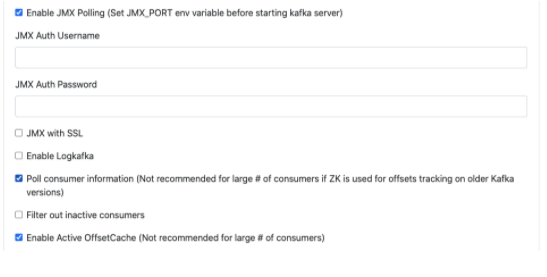
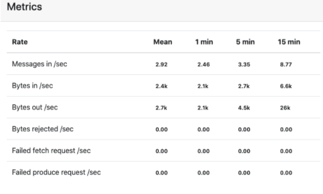
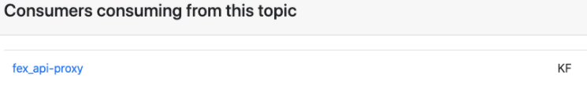

## kafka manage 

一套可视化管理 Kafka 集群的工具


### Kafka-Manage 搭建

### 1、安装：

官网下载编译好的版本： cmak-3.0.0.4.zip

[下载链接](https://github.com/yahoo/CMAK/releases/download/3.0.0.4/cmak-3.0.0.4.zip)

如果自己编译还要使用sbt

sbt是scala的打包构建工具，这一步很耗时，所以就直接使用官方编译好的。

 

cd /home/work/kafka

将 cmak-3.0.0.4.zip 下载到此目录

解压：

tar -zxvf cmak-3.0.0.4.zip 

cd cmak-3.0.0.4

编辑 vim application.conf


 <font color=green>修改以下两项配置：</font>

```bash
kafka-manager.zkhosts="10.20.0.19:2181,10.20.0.20:2181,10.20.0.22:2181"
cmak.zkhosts="10.20.0.19:2181,10.20.0.20:2181,10.20.0.22:2181" 
```

Kafka-Manager 3.0.0.4 版本，需要jdk11的环境，所以还需要安装一下jdk11。

 

启动：不需要配置 JAVA_HOME 直接指定 jdk 11 的绝对路径。

 

```
nohup bin/cmak -Dconfig.file=conf/application.conf -java-home /home/work/kafka/kafka-manager/jdk-11.0.7 >/dev/null 2>&1 &
```

 

此时启动的是默认的端口9000 如果想自己指定端口号，加上 -Dhttp.port=9001

 

### 2、更详细的监控指标：

添加cluster的时候，记得勾选上这几个选项，可以更详细的监控kafka数据。



#### 上图勾选项解释：

**<font color=green>Enable JMX Polling</font>**
是否开启 JMX 轮训，该部分直接影响 kafka broker 和 topic 监控指标的获取（生效的前提是 kafka 启动时开启了 JMX_PORT。主要影响如下指标的查看：

broker/topic 的combined metrics 综合指标



**<font color=green>Poll consumer information</font>**

是否开启获取消费信息，如果勾选上的话能够在消费者页面和 topic 页面查看消费信息

 

**<font color=green>Enable Active OffsetCache</font>**
是否开启 offset 缓存，决定 kafka-manager 是否缓存住 topic 的相关偏移量。


### 使broker/topic metrics指标生效： 

在 kafka-run-class.sh 文件里 增加这一行启动参数：JMX_PORT=9988

监听 9988 端口，获取 kafka 运行时状态信息

修改完启动脚本后，需要重新启动 kafka


### 提示：

使用 JMX_PORT=9988 启动后，会导致 kafka 的命令行无法使用，比如创建 topic，查看 topic 相关信息等命令。因为连接端口 9988 被

kafka - manage 占用了，这些操作都需要你在 kafka - manage 上进行。