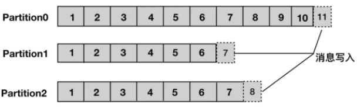
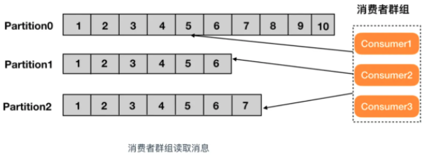

### Kafka 是什么

Kafka 是由 `Linkedin` 公司开发的，它是一个分布式的，支持多分区、多副本，基于 Zookeeper 的分布式消息流平台，它同时也是一款开源的**基于发布订阅模式的消息引擎系统**。

### Kafka 的基本术语

消息：Kafka 中的数据单元被称为`消息`，也被称为记录，可以把它看作数据库表中某一行的记录。

批次：为了提高效率， 消息会`分批次`写入 Kafka，批次就代指的是一组消息。

主题：消息的种类称为 `主题`（Topic）,可以说一个主题代表了一类消息。相当于是对消息进行分类。主题就像是数据库中的表。

分区：主题可以被分为若干个分区（partition），同一个主题中的分区可以不在一个机器上，有可能会部署在多个机器上，由此来实现 kafka 的`伸缩性`，单一主题中的分区有序，但是无法保证主题中所有的分区有序。



生产者： 向主题发布消息的客户端应用程序称为`生产者`（Producer），生产者用于持续不断的向某个主题发送消息。

消费者：订阅主题消息的客户端程序称为`消费者`（Consumer），消费者用于处理生产者产生的消息。

消费者群组：生产者与消费者的关系就如同餐厅中的厨师和顾客之间的关系一样，一个厨师对应多个顾客，也就是一个生产者对应多个消费者，`消费者群组`（Consumer Group）指的就是由一个或多个消费者组成的群体。



### Kafka 的使用场景

- 活动跟踪：Kafka 可以用来跟踪用户行为，比如我们经常回去淘宝购物，你打开淘宝的那一刻，你的登陆信息，登陆次数都会作为消息传输到 Kafka ，当你浏览购物的时候，你的浏览信息，你的搜索指数，你的购物爱好都会作为一个个消息传递给 Kafka ，这样就可以生成报告，可以做智能推荐，购买喜好等。
- 传递消息：Kafka 另外一个基本用途是传递消息，应用程序向用户发送通知就是通过传递消息来实现的，这些应用组件可以生成消息，而不需要关心消息的格式，也不需要关心消息是如何发送的。
- 度量指标：Kafka也经常用来记录运营监控数据。包括收集各种分布式应用的数据，生产各种操作的集中反馈，比如报警和报告。
- 日志记录：Kafka 的基本概念来源于提交日志，比如我们可以把数据库的更新发送到 Kafka 上，用来记录数据库的更新时间，通过kafka以统一接口服务的方式开放给各种consumer，例如hadoop、Hbase、Solr等。
- 流式处理：流式处理是有一个能够提供多种应用程序的领域。
- 限流削峰：Kafka 多用于互联网领域某一时刻请求特别多的情况下，可以把请求写入Kafka 中，避免直接请求后端程序导致服务崩溃。

 

 

### Kafka 的消息队列

Kafka 的消息队列一般分为两种模式：点对点模式和发布订阅模式

- Kafka 是支持消费者群组的，也就是说 Kafka 中会有一个或者多个消费者，如果一个生产者生产的消息由一个消费者进行消费的话，那么这种模式就是点对点模式
- 如果一个生产者或者多个生产者产生的消息能够被多个消费者同时消费的情况，这样的消息队列成为发布订阅模式的消息队列


## kafka 副本机制

副本的基本内容，在kafka中，每个主题可以有多个分区，每个分区又可以有多个副本。这多个副本中，只有一个是 leader，而其他的都是 follower 副本。仅有 leader 副本可以对外提供服务。

多个 follower 副本通常存放在和 leader 副本不同的 broker 中。通过这样的机制实现了高可用，当某台机器挂掉后，其他 follower 副本也能迅速”转正“，开始对外提供服务。

这里通过问题来整理这部分内容。

### kafka 的副本都有哪些作用？

在 kafka 中，实现副本的目的就是冗余备份，且仅仅是冗余备份，所有的读写请求都是由leader副本进行处理的。follower 副本仅有一个功能，那就是从 leader 副本拉取消息，尽量让自己跟 leader 副本的内容一致。

### follower 副本为什么不对外提供服务？

这个问题本质上是对性能和一致性的取舍。试想一下，如果 follower 副本也对外提供服务那会怎么样呢？首先，性能是肯定会有所提升的。但同时，会出现一系列问题。类似数据库事务中的幻读，脏读。

比如你现在写入一条数据到kafka主题a，消费者b从主题a消费数据，却发现消费不到，因为消费者b去读取的那个分区副本中，最新消息还没写入。而这个时候，另一个消费者c却可以消费到最新那条数据，因为它消费了leader副本。

看吧，为了提高那么些性能而导致出现数据不一致问题，那显然是不值得的。

### leader副本挂掉后，如何选举新副本？

如果你对zookeeper选举机制有所了解，就知道zookeeper每次leader节点挂掉时，都会通过内置id，来选举处理了最新事务的那个follower节点。

从结果上来说，kafka分区副本的选举也是类似的，都是选择最新的那个follower副本，但它是通过一个In-sync（ISR）副本集合实现。

kafka会将与leader副本保持同步的副本放到ISR副本集合中。当然，leader副本是一直存在于ISR副本集合中的，在某些特殊情况下，ISR副本中甚至只有leader一个副本。

当leader挂掉时，kakfa通过zookeeper感知到这一情况，在ISR副本中选取新的副本成为leader，对外提供服务。

但这样还有一个问题，前面提到过，有可能ISR副本集合中，只有leader，当leader副本挂掉后，ISR集合就为空，这时候怎么办呢？这时候如果设置unclean.leader.election.enable参数为true，那么kafka会在非同步，也就是不在ISR副本集合中的副本中，选取出副本成为leader，但这样意味这消息会丢失，这又是可用性和一致性的一个取舍了。


### Kafka 命令行操作

\# 创建一个16个分区，2个副本的 hisearch-search topic

./kafka-topics.sh --create --bootstrap-server 10.20.0.22:9092 --replication-factor 2 --partitions 16 --topic hisearch-search

 

\# kafka启动 先启动zookeeper，再启动kafka。

如有没有zookeeper环境的话，kafka有自带打包和配置好的Zookeeper。

**./zookeeper-server-start.sh -daemon ../config/zookeeper.properties**

**./kafka-server-start.sh -daemon ../config/server.properties**


\# 查看消费 Group 列表：

./kafka-consumer-groups.sh --bootstrap-server 10.20.0.22:9092 --list

./kafka-consumer-groups.sh --bootstrap-server 10.20.0.22:9092 --group test_group --describe

 

```
TOPIC  PARTITION  CURRENT-OFFSET  LOG-END-OFFSET  LAG   CONSUMER-ID   HOST  CLIENT-ID 
test   0          5               5               0       -             -      -
 
# CURRENT-OFFSET: 当前消费者群组最近提交的 offset，也就是消费者分区里读取的当前位置
# LOG-END-OFFSET: 当前最高水位偏移量，也就是最近一个读取消息的偏移量，同时也是最近一个提交到集群的偏移量
# LAG：消费者的 CURRENT-OFFSET 与 broker 的 LOG-END-OFFSET 之间的差距
```

 

 

\# 查看topic相关信息
./kafka-topics.sh --list --bootstrap-server 10.20.0.22:9092

./kafka-topics.sh --topic hisearch-search --describe --bootstrap-server 10.20.0.22:9092

 

\# 打开kafka生产者控制台（可在控制台模拟产生消息）

./kafka-console-producer.sh --broker-list 10.20.0.22:9092 --topic hisearch-search

 

\# 打开kafka消费者控制台（可在控制台观察到消息被消费）

./kafka-console-consumer.sh --bootstrap-server 10.20.0.22:9092 --topic hisearch-search --from-beginning

 

\# 查看topic里的消息量

./kafka-run-class.sh kafka.tools.GetOffsetShell --broker-list 10.20.0.22:9092 --topic fex_node --time -1

-1 表示查看的是历史所有的消息量，包括已经被删除的

-2 表示查看的是已经被删除的消息量

两者相减得出当前topic的消息量。